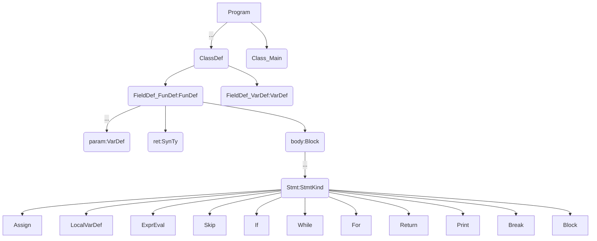
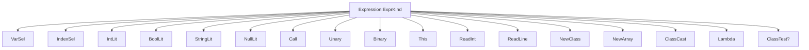
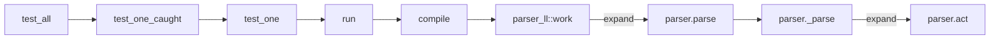

### 程序结构（syntax/src/ast.rs）


### 表达式（syntax/src/ast.rs）



### 执行流程

在parser.rs中添加`#[expand]`

```rust
#[expand]
#[lex(r##"
priority = []
```

就可以在编译时生成扩展出来的代码，分析代码，可以得到LL(1)parser的大致执行过程：




### QA

#### 为何syntax/src/ast.rs中的`struct ASTAlloc`中只有`class, func,var,program`，没有`expr`等？

#### 对decaf spec词法的理解问题？
```
syntax/parser_ll.rs [lexical]部分
# line break in a StringLit will be reported by parser's semantic act
'"[^"\\]*(\\.[^"\\]*)*"' = 'StringLit'   //???
'"[^"\\]*(\\.[^"\\]*)*' = 'UntermString' //???
'//[^\n]*' = '_Eps'
'\s+' = '_Eps'   //all space ??? 
'\d+|(0x[0-9a-fA-F]+)' = 'IntLit'
'[A-Za-z]\w*' = 'Id'
'.' = '_Err' //??? 与 '\.' = 'Dot'的区别是啥？
```
