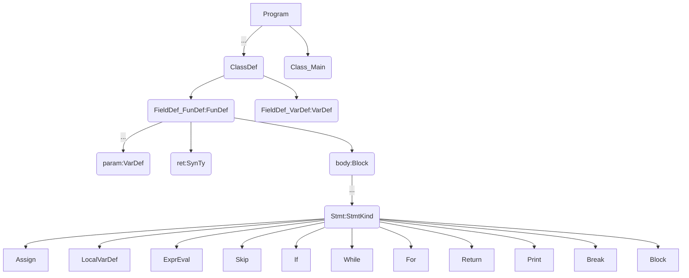
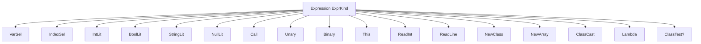
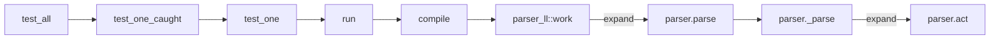

### 词法描述
in syntax/parser.rs  syntax/parser_ll.rs
```
[lexical]
'void' = 'Void'
'int' = 'Int'
'bool' = 'Bool'
'string' = 'String'
'new' = 'New'
'null' = 'Null'
'true' = 'True'
'false' = 'False'
'class' = 'Class'
'extends' = 'Extends'
'this' = 'This'
'while' = 'While'
'for' = 'For'
'if' = 'If'
'else' = 'Else'
'return' = 'Return'
'break' = 'Break'
'Print' = 'Print'
'ReadInteger' = 'ReadInteger'
'ReadLine' = 'ReadLine'
'static' = 'Static'
'instanceof' = 'InstanceOf'
'abstract' = 'Abstract'
'var' = 'Var'
'fun' = 'Fun'
'=>' = 'Arrow'
'<=' = 'Le'
'>=' = 'Ge'
'==' = 'Eq'
'!=' = 'Ne'
'&&' = 'And'
'\|\|' = 'Or'
'\+' = 'Add'
'-' = 'Sub'
'\*' = 'Mul'
'/' = 'Div'
'%' = 'Mod'
'=' = 'Assign'
'<' = 'Lt'
'>' = 'Gt'
'\.' = 'Dot'
',' = 'Comma'
';' = 'Semi' # short for semicolon
'!' = 'Not'
'\(' = 'LPar' # short for parenthesis
'\)' = 'RPar'
'\[' = 'LBrk' # short for bracket
'\]' = 'RBrk'
'\{' = 'LBrc' # short for brace
'\}' = 'RBrc'
':' = 'Colon'
# line break in a StringLit will be reported by parser's semantic act
'"[^"\\]*(\\.[^"\\]*)*"' = 'StringLit'
'"[^"\\]*(\\.[^"\\]*)*' = 'UntermString'
'//[^\n]*' = '_Eps'
'\s+' = '_Eps'
'\d+|(0x[0-9a-fA-F]+)' = 'IntLit'
'[A-Za-z]\w*' = 'Id'
'.' = '_Err'
"##)]
```

### 语法描述
in syntax/parser.rs  syntax/parser_ll.rs
```
Program -> ClassList

ClassList -> ClassDef ClassList
ClassList ->

ClassDef -> Class Id MaybeExtends LBrc FieldList RBrc
ClassDef -> Abstract Class Id MaybeExtends LBrc FieldList RBrc

MaybeExtends -> Extends Id
MaybeExtends ->

FieldList -> FieldDef FieldList
FieldList ->

FieldDef -> Static Type Id LPar VarDefListOrEmpty RPar Block
FieldDef -> Abstract Type Id LPar VarDefListOrEmpty RPar Semi
FieldDef -> Type Id FuncOrVar

FuncOrVar -> LPar VarDefListOrEmpty RPar Block
FuncOrVar -> Semi

VarDefListOrEmpty -> VarDefList
VarDefListOrEmpty ->

Type -> SimpleType ArrayOrLambda

SimpleType -> Int
SimpleType -> Bool
SimpleType -> Void
SimpleType -> String
SimpleType -> Class Id

ArrayOrLambda -> LBrk RBrk ArrayOrLambda
ArrayOrLambda -> LPar TypeListOrEmpty RPar ArrayOrLambda
ArrayOrLambda ->

VarDefList -> VarDef VarDefListRem

VarDefListRem -> Comma VarDef VarDefListRem
VarDefListRem ->

ExprListOrEmpty -> ExprList      //for Term8
ExprListOrEmpty ->

ExprList -> Expr ExprListRem

ExprListRem -> Comma Expr ExprListRem
ExprListRem ->

TypeListOrEmpty -> TypeList    //for NewArrayRem  AND  ArrayOrLambda
TypeListOrEmpty ->

TypeList -> Type TypeListRem

TypeListRem -> Comma Type TypeListRem
TypeListRem ->

VarDef -> Type Id

Block -> LBrc StmtList RBrc  // for LambdaBody AND Stmt

StmtList -> Stmt StmtList
StmtList ->

Stmt -> Simple Semi
Stmt -> If LPar Expr RPar Stmt MaybeElse
Stmt -> While LPar Expr RPar Stmt
Stmt -> For LPar Simple Semi Expr Semi Simple RPar Stmt
Stmt -> Return MaybeExpr Semi
Stmt -> Print LPar ExprList RPar Semi
Stmt -> Break Semi
Stmt -> Block

Simple -> Expr MaybeAssign
Simple -> Type Id MaybeAssign
Simple -> Var Id Assign Expr
Simple ->

MaybeAssign -> Assign Expr
MaybeAssign ->

Blocked -> Stmt

MaybeElse -> Else Blocked
MaybeElse ->

MaybeExpr -> Expr
MaybeExpr ->

Op1 -> Or
Op2 -> And
Op3 -> Eq
Op3 -> Ne
Op4 -> Lt
Op4 -> Le
Op4 -> Ge
Op4 -> Gt
Op5 -> Add
Op5 -> Sub
Op6 -> Mul
Op6 -> Div
Op6 -> Mod
Op7 -> Sub
Op7 -> Not

LambdaBody -> Arrow Expr
LambdaBody -> Block

Expr -> Expr1
Expr -> Fun LPar VarDefListOrEmpty RPar LambdaBody

Expr1 -> Expr2 Term1
Expr2 -> Expr3 Term2
Expr3 -> Expr4 Term3
Expr4 -> Expr5 Term4
Expr5 -> Expr6 Term5
Expr6 -> Expr7 Term6
Expr7 -> Op7 Expr7 // not, neg
Expr7 -> LPar ParenOrCast
Expr7 -> Expr8
Expr8 -> Expr9 Term8
Expr9 -> IntLit
Expr9 -> True
Expr9 -> False
Expr9 -> StringLit
Expr9 -> Null
Expr9 -> ReadInteger LPar RPar
Expr9 -> ReadLine LPar RPar
Expr9 -> This
Expr9 -> InstanceOf LPar Expr Comma Id RPar
Expr9 -> Id
Expr9 -> New NewClassOrArray

Term1 -> Op1 Expr2 Term1 // or
Term1 ->
Term2 -> Op2 Expr3 Term2 // and
Term2 ->
Term3 -> Op3 Expr4 Term3 // eq, ne
Term3 ->
Term4 -> Op4 Expr5 Term4 // lt, le, ge, gt
Term4 ->
Term5 -> Op5 Expr6 Term5 // add sub
Term5 ->
Term6 -> Op6 Expr7 Term6 // mul, div, mod
Term6 ->
Term8 -> LBrk Expr RBrk Term8
Term8 -> Dot Id Term8
Term8 -> LPar ExprListOrEmpty RPar Term8
Term8 ->

NewClassOrArray -> Id LPar RPar
NewClassOrArray -> SimpleType NewArrayRem

ParenOrCast -> Expr RPar
ParenOrCast -> Class Id RPar Expr9

NewArrayRem -> LBrk AfterLBrk
NewArrayRem -> LPar TypeListOrEmpty RPar NewArrayRem

AfterLBrk -> Expr RBrk
AfterLBrk -> RBrk NewArrayRem
```

### 程序结构（syntax/src/ast.rs）


### 表达式（syntax/src/ast.rs）



### 执行流程

在parser.rs中添加`#[expand]`

```rust
#[expand]
#[lex(r##"
priority = []
```

就可以在编译时生成扩展出来的代码，分析代码，可以得到LL(1)parser的大致执行过程：




### QA

#### 为何syntax/src/ast.rs中的`struct ASTAlloc`中只有`class, func,var,program`，没有`expr`等？

#### 对decaf spec词法的理解问题？
```
syntax/parser_ll.rs [lexical]部分
# line break in a StringLit will be reported by parser's semantic act
'"[^"\\]*(\\.[^"\\]*)*"' = 'StringLit'   //???
'"[^"\\]*(\\.[^"\\]*)*' = 'UntermString' //???
'//[^\n]*' = '_Eps'
'\s+' = '_Eps'   //all space ??? 
'\d+|(0x[0-9a-fA-F]+)' = 'IntLit'
'[A-Za-z]\w*' = 'Id'
'.' = '_Err' //??? 与 '\.' = 'Dot'的区别是啥？
```

#### blocked的语法规则有必要吗？
```
Blocked -> Stmt
MaybeElse -> Else Blocked
```

#### 语法规则为何由op1-7的划分？

为了表现出优先级