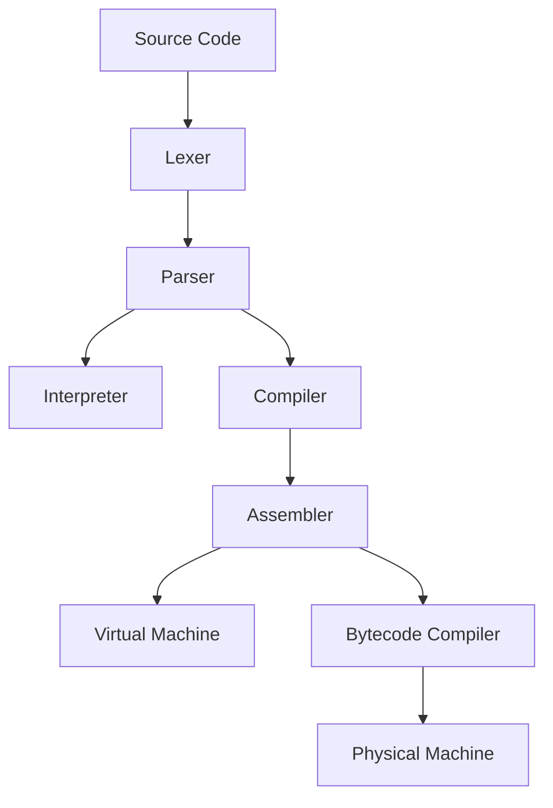

## Documentation

### PL/0 Language Tools

PL/0 is a collection of tools for learning about parsers, interpreters, compilers and virtual machines. It has been designed from the ground up to be a minimal implementation of several common interpreter and compiler functions, including the following:

- Lexical analysis and tokenisation.
- Recursive descent parsing to an abstract syntax tree.
- Direct syntax-tree interpretation.
- Static compilation to a stack based assembly language.
- Assembly from symbolic assembly language to virtual op-codes.
- Virtual machine execution using a stack-based computer.



Each major function is a separate Python program typically between 100-300 lines of code.

###  Installation

You will need to install the following requirements:

- [Python 2.6+](http://www.python.org/getit/)

- [Ply 3.0+](http://www.dabeaz.com/ply/)

- [GraphViz 2.2+](http://www.graphviz.org/) (Optional)


####  Linux (Debian/Ubuntu) 
tested on ubuntu 19.10 x86-64
```
$ sudo apt-get install python graphviz xdot
```

### Getting Started

- [How to run the examples](run.md)

### Individual Components

- [Lexer](lexer.md)
- [Parser](parser.md)
- [Interpreter](interpreter.md)
- [Compiler](compiler.md)
- [Assembler](assembler.md)
- [(Virtual) Machine](machine.md)
